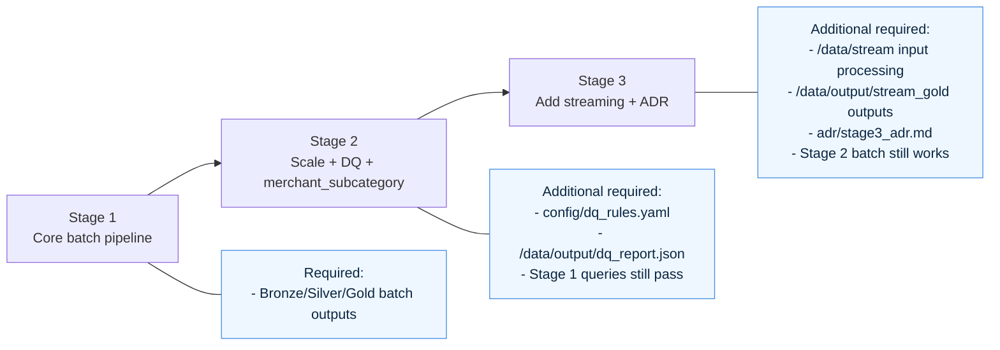
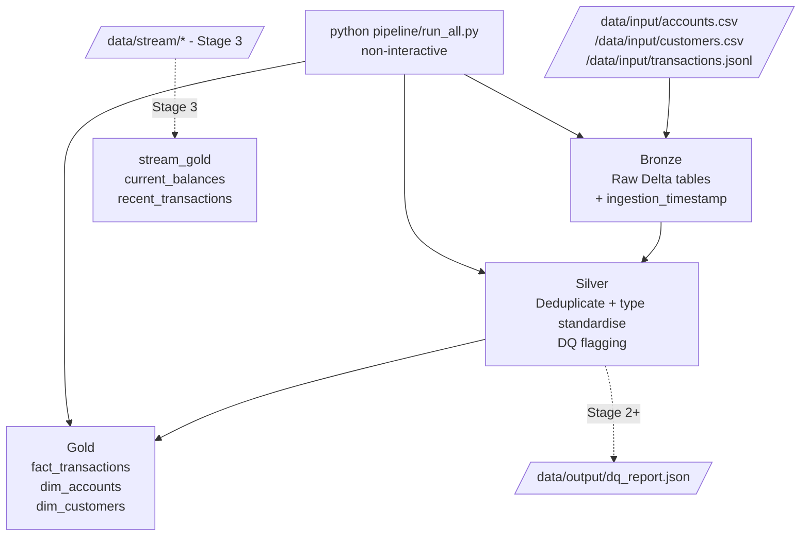
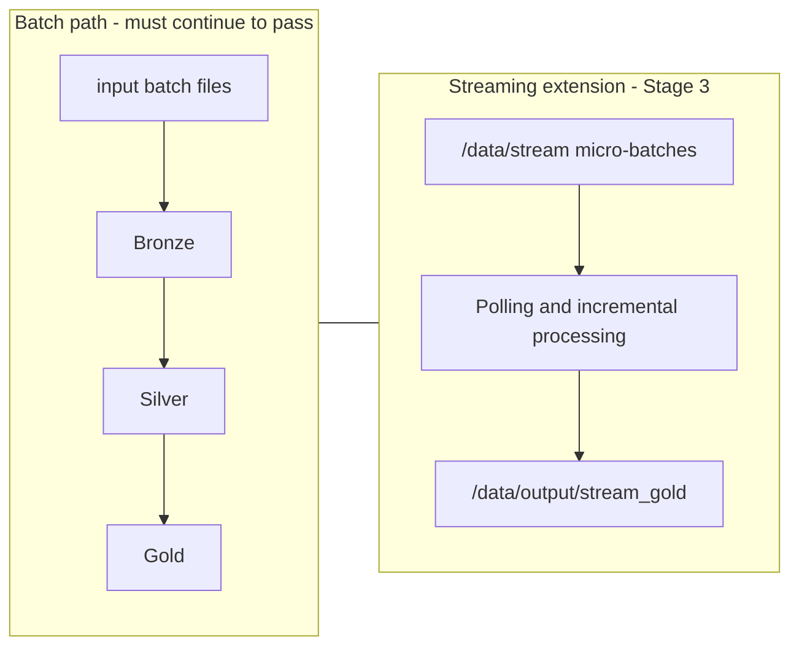
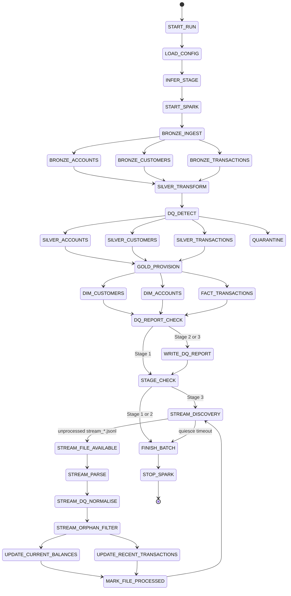

# Nedbank DE Challenge — Canonical Operator Guide

This `README.md` is the canonical runbook for operating this repository locally and in scoring-like conditions.

> `README_FIRST.md` is retained as challenge-pack reference material only. For build/run/test instructions, always follow this file.

## 1) Purpose and architecture

This repository implements the DE-track pipeline entry point expected by the scorer: `python pipeline/run_all.py`. The execution model is the **medallion pattern**:

- **Bronze**: raw ingestion from source files into Delta tables (`ingest.py`).
- **Silver**: cleaning/standardisation/DQ flagging (`transform.py`).
- **Gold**: scored business outputs (`provision.py`).

The top-level flow is deterministic and non-interactive:

1. `run_ingestion()`
2. `run_raw_profile()` only when `credibility_rules.yaml` sets `profile.mode: full`
3. `run_transformation()` and light raw-profile metric collection
4. `run_raw_profile()` light audit JSON write when `profile.mode: light`
5. `run_provisioning()`

`runtime.mode: scorer` is the default and follows that path. `runtime.mode:
adaptive` is opt-in for larger local runs; it preflights input size and Docker
limits, then uses resumable transaction hash buckets only when the derived tier
is `large`.

No prompts or stdin reads are allowed in the scoring container (no TTY attached).

## 2) Data sources and expected outputs

### Expected input mount points

The scoring contract mounts challenge data at fixed container paths:

- `/data/input/accounts.csv`
- `/data/input/customers.csv`
- `/data/input/transactions.jsonl`
- `/data/config/pipeline_config.yaml`
- `/data/config/dq_rules.yaml` (**required from Stage 2 onward**)
- `/data/stream/` (Stage 3 streaming micro-batches)

### Expected output paths

Your pipeline must write to the exact output roots below:

- `/data/output/bronze/`
- `/data/output/silver/`
- `/data/output/gold/`
- `/data/output/dq_report.json` (Stage 2+)
- `/data/output/audit/raw_anomaly_profile.json` (audit-only, not scorer-facing)
- `/data/output/audit/performance_profile.json` (audit-only phase timing)
- `/data/output/audit/chunk_manifest.json` (adaptive mode only)
- `/data/output/stream_gold/` (Stage 3)

Raw anomaly profiling is controlled by `config/credibility_rules.yaml`:

- `profile.mode: light` is the default scoring mode. It reuses ingest/transform aggregates and avoids an extra raw-table scan.
- `profile.mode: full` keeps the richer Bronze scan with capped top-K summaries for investigation runs.
- `profile.mode: off` disables the advisory profile while leaving the scored outputs unchanged.
- `profile.domain_drift` reports audit-only unknown-value drift for known banking domains. Light mode emits invalid counts and approximate cardinalities; full mode can add capped top unknown values and candidate rule suggestions.

Gold tables expected by validation queries:

- `/data/output/gold/fact_transactions`
- `/data/output/gold/dim_accounts`
- `/data/output/gold/dim_customers`

## 3) Exact local build/run commands (scoring-like constraints)

### 3.0 Container-first workflow

Use Docker as the source of truth for dependency setup and validation. The scorer
runs this repository in a container, not in a local Python virtual environment, so
the local workflow should mirror that shape as closely as possible.

The repository includes `infrastructure/Dockerfile.base` for building the local
challenge base image. That base image contains Python, Java, PySpark, Delta Lake,
pandas, PyArrow, PyYAML, and DuckDB. `requirements.txt` is only for extra
packages beyond the base image.

Avoid installing the base Spark stack into `venv/`; PySpark is large, Java-backed,
and easier to keep compatible inside the Docker image.

### 3.1 Build the local base image

Run this once per machine, or whenever `infrastructure/Dockerfile.base` changes:

```bash
docker build -t nedbank-de-challenge/base:1.0 -f infrastructure/Dockerfile.base infrastructure
```

Optional smoke test:

```bash
docker run --rm nedbank-de-challenge/base:1.0 python -c "import pyspark, delta, pandas, pyarrow, yaml, duckdb; print('base deps ok')"
```

### 3.2 Build the submission image

```bash
docker build -t my-submission:test .
```

Optional smoke test:

```bash
docker run --rm my-submission:test python -c "import pyspark, delta, pandas, pyarrow, yaml, duckdb; print('submission deps ok')"
```

### 3.3 Prepare local test mount

Create a local directory shaped exactly like the scorer mount:

```bash
mkdir -p /tmp/test-data/input /tmp/test-data/config /tmp/test-data/output
cp /path/to/accounts.csv /tmp/test-data/input/
cp /path/to/customers.csv /tmp/test-data/input/
cp /path/to/transactions.jsonl /tmp/test-data/input/
cp config/pipeline_config.yaml /tmp/test-data/config/
# Stage 2+ only:
cp config/dq_rules.yaml /tmp/test-data/config/
```

On Windows PowerShell, the repository-local data layout can also be mounted
directly:

```powershell
docker run --rm `
  -v "h:\hikrepos\dateng-nednov-track\data\input:/data/input:ro" `
  -v "h:\hikrepos\dateng-nednov-track\config:/data/config:ro" `
  -v "h:\hikrepos\dateng-nednov-track\data\output:/data/output:rw" `
  my-submission:test `
  python pipeline/run_all.py
```

### 3.4 Run with scorer-equivalent resource/security flags

```bash
docker run --rm \
  --network=none \
  --memory=2g --memory-swap=2g \
  --cpus=2 \
  --pids-limit=512 \
  --read-only \
  --tmpfs /tmp:rw,size=512m \
  --cap-drop=ALL \
  --security-opt no-new-privileges \
  -e PYTHONDONTWRITEBYTECODE=1 \
  -v /tmp/test-data/input:/data/input:ro \
  -v /tmp/test-data/config:/data/config:ro \
  -v /tmp/test-data/output:/data/output:rw \
  my-submission:test \
  python pipeline/run_all.py
```

For Stage 3, add:

```bash
-v /tmp/test-stream:/data/stream:ro
```

## 4) Local development tools: venv, notebooks, and DAGs

A local `venv` is optional and should be treated as a convenience for editor
features, quick Python-only checks, or lightweight scripts. It is not the
authoritative dependency environment for this challenge.

Notebooks may be useful for exploring input data and sketching transformations,
but they must not become part of the scoring path. Keep reproducible logic in
`pipeline/*.py`.

Do not add Airflow or external orchestrator DAGs for the scored path. For this
repository, `pipeline/run_all.py` is the required DAG: a deterministic sequence
of Bronze, Silver, and Gold steps that can run non-interactively in Docker.

## 5) Pipeline execution flow and non-interactive behavior

The required execution command is:

```bash
python pipeline/run_all.py
```

`pipeline/run_all.py` orchestrates ingest, optional full raw profiling, transform, default light raw profiling, and provision in sequence. It is the official entry point used by automated scoring.

Operational requirements:

- Do **not** add `input()` or any blocking prompt logic.
- Do **not** rely on stdin.
- Exit code must be `0` on success.

## 6) Validation instructions

### 6.1 Run the local test harness

```bash
bash infrastructure/run_tests.sh --stage 1 --data-dir /tmp/test-data --image my-submission:test
```

Stage-specific harness examples:

```bash
bash infrastructure/run_tests.sh --stage 2 --data-dir /tmp/test-data --image my-submission:test
bash infrastructure/run_tests.sh --stage 3 --data-dir /tmp/test-data --stream-dir /tmp/test-stream --image my-submission:test
```

### 6.2 Run DuckDB validation checks

The submission image already includes the `duckdb` Python package. Prefer the
Python validator because it reads Delta tables by parsing `_delta_log/` and
passing the active Parquet files to `duckdb.parquet_scan`, so it does not need
the optional DuckDB `delta` extension.

```bash
docker run --rm \
  -v /tmp/test-data/output/gold:/data/output/gold:ro \
  my-submission:test \
  python infrastructure/validate_gold.py --gold-path /data/output/gold
```

`docs/validation_queries.sql` is still retained as the scorer-facing SQL
reference for environments that have DuckDB's `delta_scan` extension.

## 7) Stage-specific operator notes

### Stage 1

- Batch-only flow is sufficient.
- `dq_rules.yaml` not required.

### Stage 2

- `config/dq_rules.yaml` is required and must drive DQ handling behavior.
- `dq_report.json` is expected at `/data/output/dq_report.json`.

### Stage 3

- Implement streaming ingestion for files delivered via `/data/stream/`.
- Write streaming outputs under `/data/output/stream_gold/`.
- Include ADR at `adr/stage3_adr.md`.
- Batch pipeline compatibility from Stage 2 must remain intact.

## 8) Reference documents

- `docs/submission_guide.md`
- `docs/README_DOCKER.md`
- `docs/output_schema_spec.md`
- `docs/validation_queries.sql`
- `docs/stage2_spec_addendum.md`
- `docs/stage3_spec_addendum.md`


## 9) Visual model: stages and medallion levels

### 9.1 Stage progression (what changes over time)



### 9.2 Medallion flow (what happens inside one run)



### 9.3 How Stage 3 extends (does not replace) batch



### 9.4 Detailed pipeline state graph



The Stage 3 stream path starts only after the batch Gold layer exists, because stream events are checked against `dim_accounts`. `current_balances` starts from the batch account balance, then applies stream deltas; `recent_transactions` keeps the latest 50 transactions per account.
